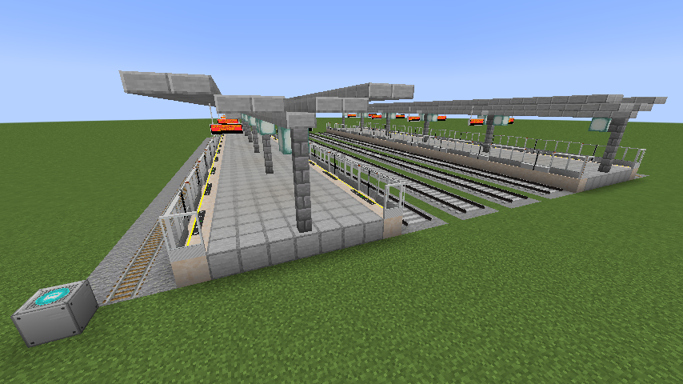
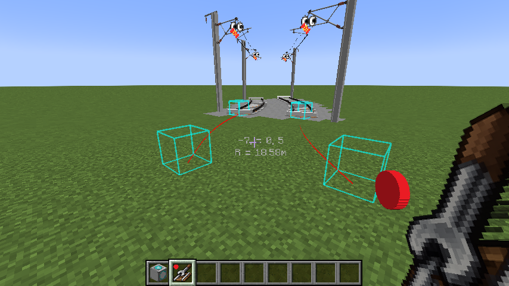
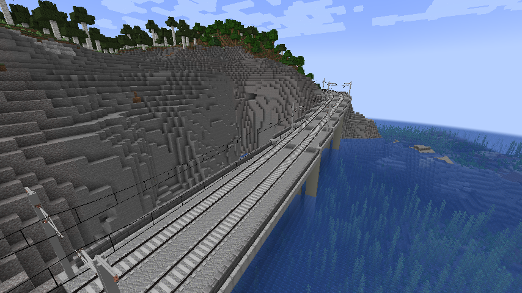
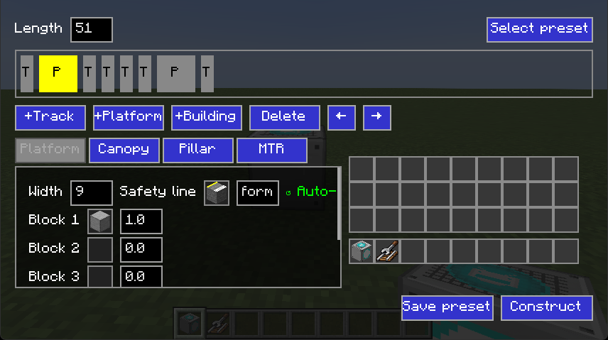
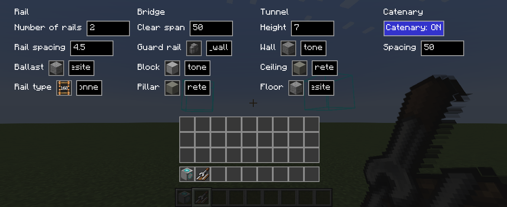

# Station Builder

> Create decorated railways and stations with few clicks!

Station Builder provides 2 tools for convenient construction of continuous rails and train stations.

+ Station Builder: A block to create train station with multiple platforms and tracks. Pillars, canopys, saftey lines/doors, and ballasts are created automatically in one click. **NOTE:** Saftey lines/doors needs [Minecraft Transit Railway](https://modrinth.com/mod/minecraft-transit-railway) to work.

+ Rail Builder: An item for continuous parallel rails' construction. It could create tunnels, bridges, piers, catenary and ballasts for the rail automatically. 
**NOTE:** This tool needs [Minecraft Transit Railway](https://modrinth.com/mod/minecraft-transit-railway) to work, and the catenary needs [Station Decoration (MSD)](https://modrinth.com/mod/station-decoration) to work.

This mod is developed using Fabric, and in its very early preview. Bugs are likely to exist, and please Forge versions may be released in the future.

## Images

+ Build a station

+ Build a rail

+ Tunnel

+ Bridge

+ Station Builder GUI

+ Rail Builder GUI

## Development Plan
As most function of this mod requires Minecraft Transit Railway (MTR), the mod currently will not support higher version than MTR does. This mod currently only supports 1.20.4 for Fabric, but work will be done in recent future in the following sequence:

1. Allow the Rail Builder to work without MTR.

2. Provide forge version for both 1.20.1 and 1.20.4.

3. Propose better building elements for Station Builder.