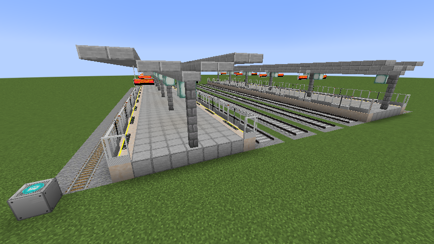
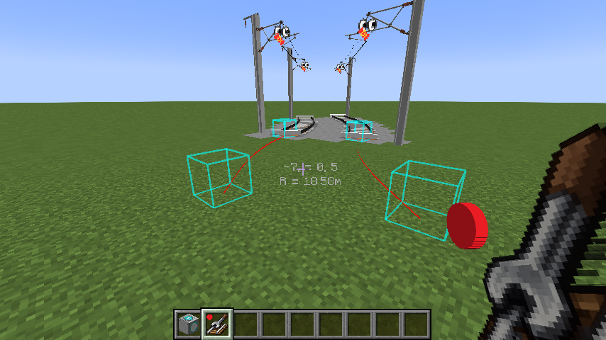
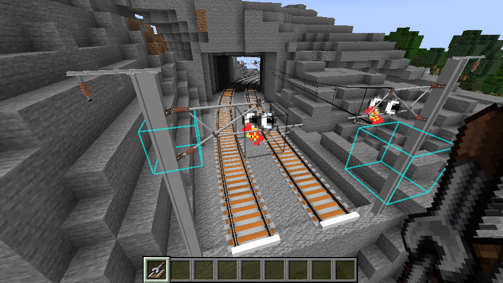
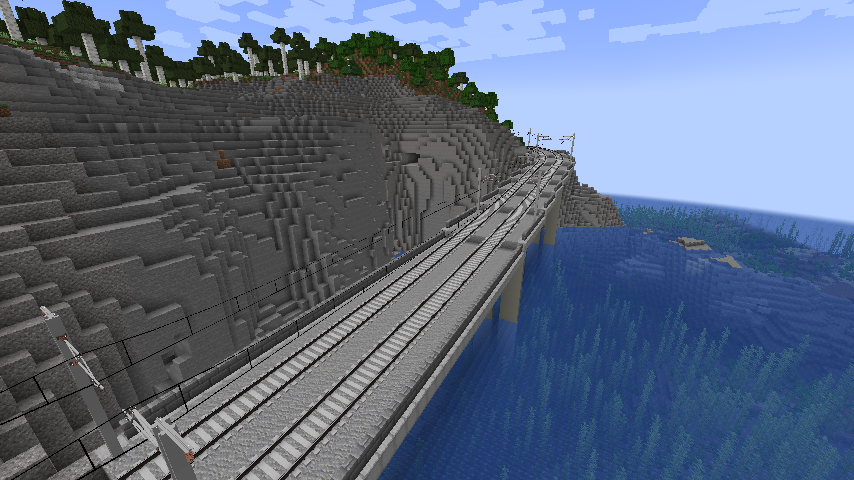
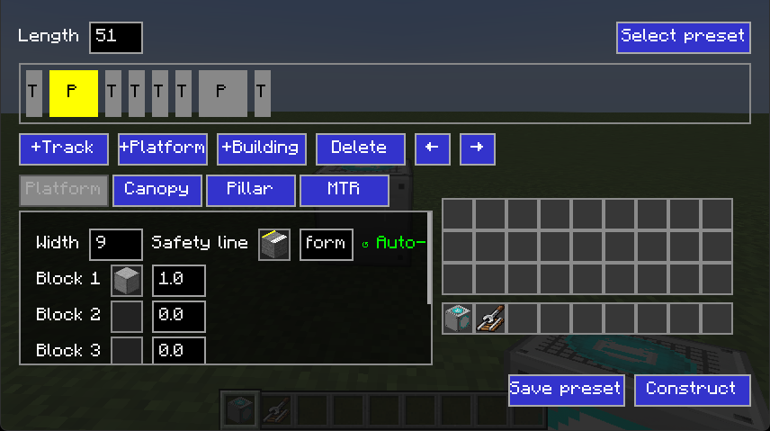
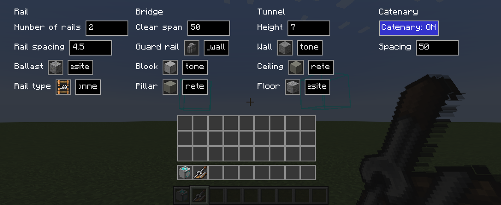

# Station Builder

> Create decorated railways and stations with few clicks!

+ Curseforge: https://www.curseforge.com/minecraft/mc-mods/station-builder
+ Modrinth: https://modrinth.com/mod/station-builder
+ mcmod.cn (Chinese): https://www.mcmod.cn/class/24815.html

Station Builder provides 2 tools for convenient construction of continuous rails and train stations.

+ Station Builder: A block to create train station with multiple platforms and tracks. Pillars, canopys, saftey lines/doors, passenger information display system (PIDS), and ballasts are created automatically in one click.
  - Right click to open GUI and construct.
  - Use WorldEdit to save buildings as .schem files (//schem save building_name), and load them in Station builder block's GUI.
  - **NOTE:** Saftey lines/doors and PIDS needs Minecraft Transit Railway 4.0.0+ to work.

+ Rail Builder: An item for continuous parallel rails' construction. It could create tunnels, bridges, piers, catenary and ballasts for the rail automatically. 
  - Right click to build continuous parallel rails. Shift + Right click to open GUI for configuration. Press V to stop continuous building.
  - **NOTE:** This tool needs [Minecraft Transit Railway](https://modrinth.com/mod/minecraft-transit-railway) to work, and the catenary needs [Station Decoration (MSD)](https://modrinth.com/mod/station-decoration) to work.

This mod is developed using Fabric, and is in its very early preview (may be many bugs). Forge versions may be released in the future.

## Images

+ Build a station

+ Build a rail

+ Tunnel

+ Bridge

+ Station Builder GUI

+ Rail Builder GUI
